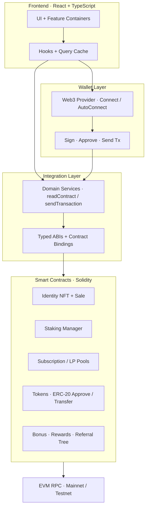
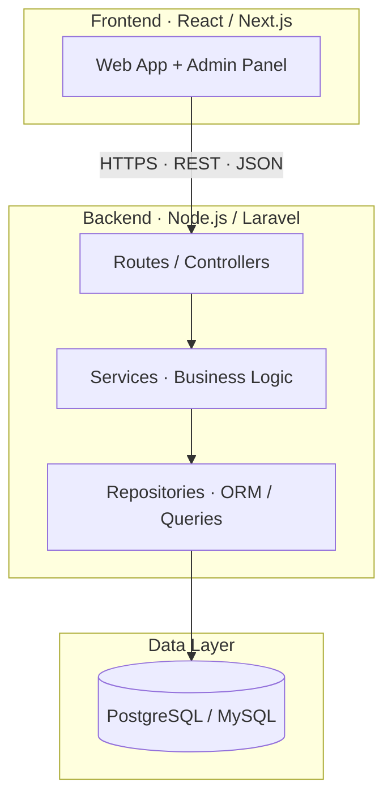

<!--
  Sube ESTE README.md y la carpeta assets/ al repo:
  https://github.com/Edgar-Devloper/Edgar-Devloper

  El banner tiene que existir en:
  /assets/banner.svg
-->

<div align="center">
  
</div>

<br />

<div align="center">

[](https://git.io/typing-svg)

<br />

[](mailto:edgara.velazquezg@gmail.com)
[](https://www.linkedin.com/in/edgar-velazquez-9a1459266/)
[](https://github.com/Edgar-Devloper)
[](https://github.com/Edgar-Devloper?tab=repositories)

</div>

---

```bash
$ whoami
edgar.velazquez  —  Full-Stack & Backend Engineer
$ cat mission.txt
Diseño sistemas que llegan a producción: APIs REST, frontends
y bases relacionales. Código limpio, arquitectura modular,
lógica de negocio bien abstraída.
$ status --hire
available_for_hire: true
location: Venezuela · Remote
```

## `~/stack`

<p align="center">
  
</p>

```
backend   │  Node.js 18+ · TypeScript · Express · Laravel (PHP)
frontend   │  React · Next.js · HTML5 · CSS3
data       │  PostgreSQL · MySQL
web3       │  Solidity · Smart Contracts · Tokens · NFT
practice   │  Clean Code · Modular Architecture · Agile
```

## `~/architecture`

Dos enfoques de producto que construyo por separado — sin mezclar capas.

### `web3` · Solidity + Frontend (descentralizado)

dApp híbrida: estado financiero y lógica de negocio **on-chain**, con frontend que firma transacciones vía wallet y servicios tipados sobre ABIs.



```
UI → Hooks → Wallet → Services → ABIs → Smart Contracts → Blockchain
```

### `backend` · REST API (centralizado)

Productos web clásicos: frontend consume APIs, la lógica vive en el servidor y la persistencia en base relacional.



```
Client → REST API → Services → Repositories → Database
```

## `~/projects`

<table>
  <tr>
    <td valign="top" width="50%">
      <h3><a href="https://github.com/Edgar-Devloper/Pollos_v2_Backend">Pollos_v2_Backend</a></h3>
      API TypeScript de un producto en producción.<br/><br/>
      <code>TypeScript</code> · <code>Node.js</code> · <code>API</code>
    </td>
    <td valign="top" width="50%">
      <h3><a href="https://github.com/Edgar-Devloper/Pollo_v2_Admin">Pollo_v2_Admin</a></h3>
      Panel de administración del mismo producto.<br/><br/>
      <code>JavaScript</code> · <code>Dashboard</code>
    </td>
  </tr>
  <tr>
    <td valign="top">
      <h3><a href="https://github.com/Edgar-Devloper/Front-Products">Front-Products</a></h3>
      Frontend de catálogo / productos.<br/><br/>
      <code>TypeScript</code> · <code>React</code>
    </td>
    <td valign="top">
      <h3><a href="https://github.com/Edgar-Devloper/solidity-governance-vault">solidity-governance-vault</a></h3>
      Vault de gobernanza con decay de voting power.<br/><br/>
      <code>Solidity</code> · <code>Web3</code>
    </td>
  </tr>
  <tr>
    <td valign="top">
      <h3><a href="https://github.com/Edgar-Devloper/backend-usuarios">backend-usuarios</a></h3>
      API de gestión de usuarios.<br/><br/>
      <code>JavaScript</code> · <code>Auth</code>
    </td>
    <td valign="top">
      <h3><a href="https://github.com/Edgar-Devloper/Front-End-Poll">Front-End-Poll</a></h3>
      Frontend en TypeScript.<br/><br/>
      <code>TypeScript</code> · <code>UI</code>
    </td>
  </tr>
</table>

## `~/connect`

```ts
const contact = {
  email:    "edgara.velazquezg@gmail.com",
  linkedin: "linkedin.com/in/edgar-velazquez-9a1459266",
  github:   "github.com/Edgar-Devloper",
  openTo:   ["full-time remote", "contract"],
};
```

**mailto: [edgara.velazquezg@gmail.com](mailto:edgara.velazquezg@gmail.com)**  
**linkedin: [edgar-velazquez](https://www.linkedin.com/in/edgar-velazquez-9a1459266/)**  
**github: [Edgar-Devloper](https://github.com/Edgar-Devloper)**
